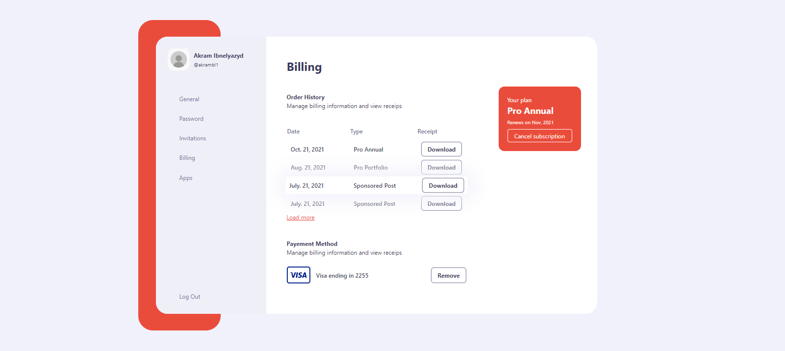
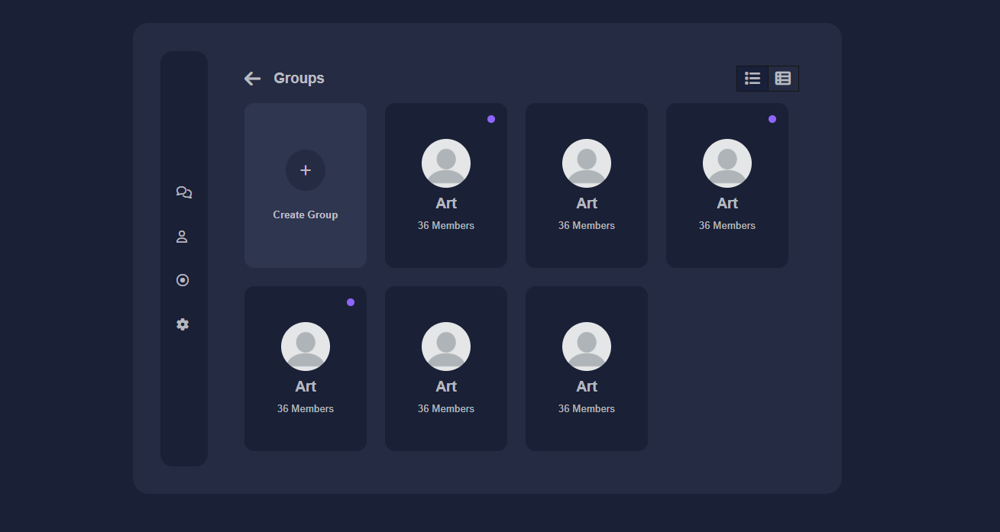
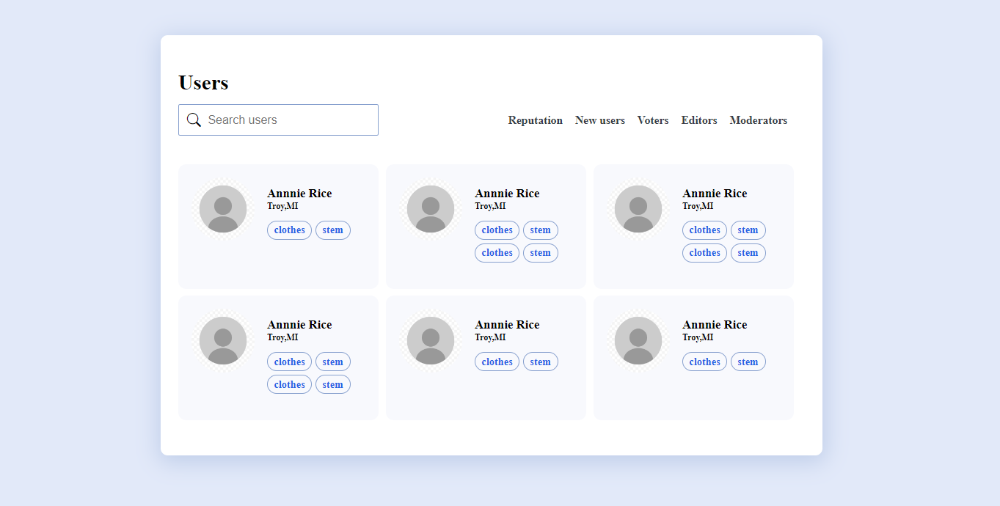

# CSS Exercises

Welcome to the CSS Exercises repository! This repository contains a collection of exercises and projects aimed at helping you improve your skills in HTML and CSS. Whether you're a beginner looking to learn the basics or an intermediate developer wanting to sharpen your skills, you'll find a variety of exercises to suit your needs.

## Exercises

The exercises are organized by difficulty level and topic. Here's a brief overview of the types of exercises you'll find:

1. **Basic HTML**: Learn the fundamentals of HTML, including elements, attributes, and structure.
2. **Basic CSS**: Understand the basics of CSS, including selectors, properties, and styling techniques.
3. **Intermediate HTML**: Dive deeper into HTML with forms, tables, and semantic elements.
4. **Intermediate CSS**: Explore advanced CSS topics such as layouts, flexbox, and grid.
5. **Responsive Design**: Practice creating responsive web pages that look great on any device.

